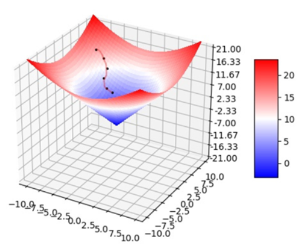

# Study record: How does the neural network work?

In fastai tutorial "How to Understand How Neural Networks Really Work," Jeremy Howard details the basic components and workings of neural networks.  

Starting with a simple definition of neural networks, the paper explains how networks make predictions by learning patterns in input data. 
The concepts of forward propagation and back propagation, as well as the role of loss functions and the importance of optimization algorithms such as gradient descent in network training are emphasized. 
In addition, Howard uses code examples to show how these concepts work in practice to help us intuitively understand how neural networks work.

## 1. Optimization algotithm: Gradient decent

### 1.1 Concept

Gradient descent is a first-order optimization algorithm. To find the local minimum of a function using gradient descent, the function must be iteratively searched for a specified step distance point in the opposite direction of the previous point corresponding to the gradient (or approximate gradient).



Gradient descent is a kind of iterative method that can be used to solve linear and nonlinear least squares problems. When solving the model parameters of machine learning algorithms such as unconstrained optimization problems, gradient descent and least squares are the most commonly used methods.

### 1.2 Principle

Gradient descent is a method to find the minimum value of a function through an iterative process. Suppose we have a objective function $f(x)$ where $x$ represents the parameters of the model. At each step, we calculate the gradient $∇f(x)$ and then update the next iteration.

Step1:  
Find the direction of steepest slope $∇f(x_1)$ , and extend a search line in this direction:  

$z(t) = x_1 - t∇f(x_1)$  

Points on this line $z$ are defined by a set of points parameterised by a distance along the line, $t>0$ .

Step2:  
Find a function, which is our objective function along the line z, parameterised by the scalar $t$ :  $g(t) = f(z(t))$ .  
Determing the minimum value of $g(t)$ along the line by solving $∇g(t)=0$ .

Step3:  
This value of $t=t_1$ is used to calculate the coordinates of the minimum along the line:  

$x_2 = z(t_1) = x_1  –  t_1∇f(x_1)$  

We use this $x_2$ as our next starting point for our guess at the minimum.

Step3:
We repeat this process until the solution converges:  
a. Find gradient and extend line.  
b. Find minimum along line.  
c. Go to this point and repeat from step 1.  

### 1.3 Code  

```python
# An example of gradient descent using python 
from sklearn.linear_model import SGDRegressor
from sklearn.preprocessing import StandardScaler
standardScaler = StandardScaler()
X_train_sta = standardScaler.transform(X_train)
X_test_sta = standardScaler.transform(X_test)
sgd_reg = SGDRegressor(n_iter=100000)
sgd_reg.fit(X_train_sta,y_train)
sgd_reg.score(X_test_sta,y_test)
```

